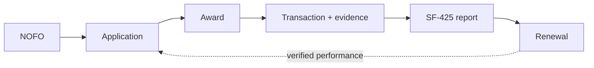

# GrantLoop

🔧 **ready to build** — schema, event contract, allowability rules and seed scenario are landed. Agents are next.

> Most grant software remembers the documents. GrantLoop remembers the promises.

An autonomous agent fleet that carries a federal grant from application through award, spending,
and reporting as one living object. Built for the All Things Agentic hackathon (submission Aug 31).

| Thing | Where |
|---|---|
| Why each agent exists, schedule, open risks | [`PLANS/GRANTLOOP_PLAN.md`](PLANS/GRANTLOOP_PLAN.md) |
| Pub/Sub topics and message envelope | [`schema/EVENT_CONTRACT.md`](schema/EVENT_CONTRACT.md) |
| Obligation model | [`schema/obligation.schema.json`](schema/obligation.schema.json) |
| 7-value allowability rules (2 CFR 200) | [`schema/allowability_rules.v0.json`](schema/allowability_rules.v0.json) |
| Riverbend demo scenario / replay seed | [`seed/riverbend_scenario.json`](seed/riverbend_scenario.json) |
| GCP + Gemini validation, and the blocker | [`docs/GCP_VALIDATION_2026-08-26.md`](docs/GCP_VALIDATION_2026-08-26.md) |
| eCFR verification of every citation | [`docs/ECFR_VERIFICATION_2026-08-26.md`](docs/ECFR_VERIFICATION_2026-08-26.md) |

## The lineage

Every budget line, outcome and reporting promise carries forward. Click a dollar on the SF-425 and
walk back to the sentence in the proposal that promised it. That provenance chain is the
differentiator, not the agent count.

## Architecture

Two Cloud Run services, five agents, real Pub/Sub between all of them. No agent ever calls another
agent — every transition is an event carrying `causation_id`, and every handler is idempotent on
`idempotency_key`.

- `orchestrator` — Intake, Application, Covenant, Reporting
- `ledger-sentinel` — split out because it is the only high-volume, push-subscription,
  retry-and-DLQ-heavy component, and it is the one on screen during the demo

Full reasoning in the plan.

## Status

Open items

- ⛔ **Blocker:** only `gemini-2.5-flash` returns 200 on `modelmind-491801`; every Gemini 3.x id
  404s. Submission rules require 3.5+. Build behind a single `MODEL_ID` env var.
- Cloud Run, Firestore, Artifact Registry and Cloud Build are not yet enabled on the project.
- ✅ CFR citations are verified against eCFR (snapshot 2026-08-01). Four were wrong and are fixed —
  see the verification doc. Two demo beats changed as a result: the laptop block rests on award term
  SC-2 rather than 2 CFR 200.439, and chamber dues are allowable under 200.454(c) with the escalation
  turning only on whether the organization's primary purpose is lobbying.

## Disclosure

Ledger feed, agency submission and QuickBooks integration are simulated, and labelled as such
on screen. Discovery and full proposal generation are out of scope.
