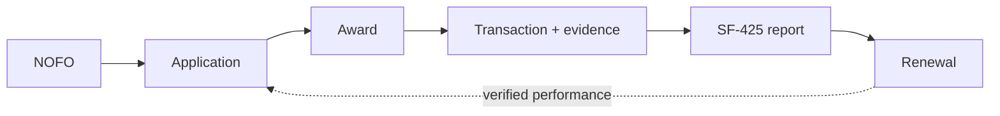

# GrantLoop

🔧 **building** — Ledger Sentinel and the deterministic replay CLI are working and tested. Citations are eCFR-verified. Cloud deploy is next.

> Most grant software remembers the documents. GrantLoop remembers the promises.

An autonomous agent fleet that carries a federal grant from application through award, spending,
and reporting as one living object. Built for the All Things Agentic hackathon (submission Aug 31).

| Thing | Where |
|---|---|
| Why each agent exists, schedule, open risks | [`PLANS/GRANTLOOP_PLAN.md`](PLANS/GRANTLOOP_PLAN.md) |
| Pub/Sub topics and message envelope | [`schema/EVENT_CONTRACT.md`](schema/EVENT_CONTRACT.md) |
| Obligation model | [`schema/obligation.schema.json`](schema/obligation.schema.json) |
| 7-value allowability rules (2 CFR 200) | [`schema/allowability_rules.v0.json`](schema/allowability_rules.v0.json) |
| Riverbend demo scenario / replay seed | [`seed/riverbend_scenario.json`](seed/riverbend_scenario.json) |
| GCP + Gemini validation, and the blocker | [`docs/GCP_VALIDATION_2026-08-26.md`](docs/GCP_VALIDATION_2026-08-26.md) |
| eCFR verification of every citation | [`docs/ECFR_VERIFICATION_2026-08-26.md`](docs/ECFR_VERIFICATION_2026-08-26.md) |

## The lineage



Every budget line, outcome and reporting promise carries forward. Click a dollar on the SF-425 and
walk back to the sentence in the proposal that promised it. That provenance chain is the
differentiator, not the agent count.

## Architecture

Two Cloud Run services, five agents, real Pub/Sub between all of them. No agent ever calls another
agent — every transition is an event carrying `causation_id`, and every handler is idempotent on
`idempotency_key`.

- `orchestrator` — Intake, Application, Covenant, Reporting
- `ledger-sentinel` — split out because it is the only high-volume, push-subscription,
  retry-and-DLQ-heavy component, and it is the one on screen during the demo

Full reasoning in the plan.

## Run it

Nothing to install and no cloud project needed. The replay path is pure Python by design —
it is the record-day fallback, and a demo path that never touches the network cannot fail
because of the network.

```bash
python -m grantloop.api                    # dashboard + live API on http://127.0.0.1:8080
python -m grantloop.replay                 # seven transactions, seven determinations
python -m grantloop.replay --pace 1.5      # narratable pace, for the demo video
python -m grantloop.replay --dlq TXN-004   # force retry + dead-letter, on camera
python -m grantloop.replay --redeliver     # publish everything twice; output is identical
python -m grantloop.replay --json          # API-shaped state for the dashboard
```

Tests:

```bash
python -m venv .venv && .venv/bin/pip install -e ".[dev]"
.venv/bin/python -m pytest -q
```

The suite is the acceptance bar for demo beat 3: all seven determination values must fire
exactly once against the seeded ledger, and no CFR citation may render without a verified
section and title.

### The read API

`python -m grantloop.api` serves the dashboard and the orchestrator API on one port,
standard library only. The same route table backs the ASGI app that Cloud Run runs, so the
recorded demo and the deployed service cannot drift — a test fails at startup if they do.

| Route | Returns |
|---|---|
| `/api/health` | mode, model id, project, ruleset version, `citations_verified` |
| `/api/state/award` | award deltas and specific conditions |
| `/api/state/ledger?limit=N` | transactions with actual determinations and structured citations |
| `/api/state/exceptions` | dead-letter queue |
| `/api/state/report/current` | SF-425 draft, every line traceable, uncertified by construction |
| `/api/replay` | re-run the fleet |

### Cloud mode

Set two environment variables and the same code runs against real Pub/Sub and Vertex:

```bash
export GOOGLE_CLOUD_PROJECT=<project>     # absent = offline mode
export MODEL_ID=gemini-3.5-flash          # single swap point for model access
```

No project id is hardcoded anywhere. The project moved once already; the model id is
expected to move again.

## Status

<details>
<summary>Open items</summary>

- ⛔ **Blocker:** only `gemini-2.5-flash` returns 200 on `modelmind-491801`; every Gemini 3.x id
  404s. Submission rules require 3.5+. Build behind a single `MODEL_ID` env var.
- Cloud Run, Firestore, Artifact Registry and Cloud Build are not yet enabled on the project.
- ✅ CFR citations are verified against eCFR (snapshot 2026-08-01). Four were wrong and are fixed —
  see the verification doc. Two demo beats changed as a result: the laptop block rests on award term
  SC-2 rather than 2 CFR 200.439, and chamber dues are allowable under 200.454(c) with the escalation
  turning only on whether the organization's primary purpose is lobbying.

</details>

## Disclosure

Ledger feed, agency submission and QuickBooks integration are simulated, and labelled as such
on screen. Discovery and full proposal generation are out of scope.
